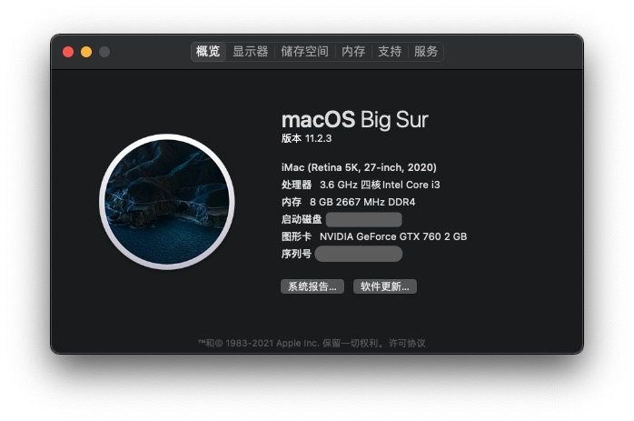

English | [简体中文](./README.md)

# OpenCore EFI Folder For Hackintosh Installation

OpenCore Version: v0.6.8

macOS Version: Big Sur(11.2.3)

## Main Specification

| Component   | Model                                                        |
| ----------- | ------------------------------------------------------------ |
| CPU         | Intel Core i3-10100F 4-Cores And 8-Threads @ 3.6GHz （**Comment Lake** CPUs Are Supported，**Celeron** and **Pentium** CPUs Are Not Supported） |
| MotherBoard | MSI H510M A-PRO （**MSI H410M PRO-E** Are Supported)     |
| GPU         | ASUS Nvdia GTX 760 2G GDDR5 （Recommended Use GPUs : **Nvdia GTX 6XX , 7XX** And **Radeon RX 5XX** Etc) |
| SSD         | 256G Plextor M6S (**NVMe**'s SSD Are Supported)          |
| Ethernet    | On-board Intel I219V V10 1G (**MSI H410M PRO-E** On-board **Realtek RTL8111L 1G**) |

## Installation

1. Create [macOS installer](https://dortania.github.io/OpenCore-Install-Guide/installer-guide/mac-install.html#downloading-macos-modern-os).

2. Use [GenSMBIOS](https://github.com/corpnewt/GenSMBIOS) to generate your SMBIOS data for your `config.plist`.

3. Follow [Dortania's OpenCore Big Sur Installation Guide](https://dortania.github.io/OpenCore-Install-Guide/extras/big-sur/#table-of-contents).

## Working

- On-board Ethernet
- iMessage, iCloud, FaceTime, App Store, Apple Music
- All USB ports
- Sleep and Wake-up

## Not Working

- AirDrop, Sidecar
- Unlock with Apple Watch

\* AirDrop, Sidecar and Unlock with Apple Watch need to switch to the compatible Broadcom Wireless/Bluetooth Card

## FAQ

### Q: Ethernet Card cannot working

If You Use **MSI H410M PRO-E** , Kext -> Add -> RealtekRTL8111.kext -> Enabled : True Kext -> Add -> IntelMausi.kext -> Enabled : False

### Q: GUI are failured

To Get Started, We're Gonna Need **OpenCore 0.6.8** .

 Add The [Resources](https://github.com/acidanthera/OcBinaryData) To EFI/OC

- Add The [Resources](https://github.com/acidanthera/OcBinaryData) to EFI/OC

- Add **OpenCanopy.efi** To EFI/OC/Drivers

  *Note: OpenCanopy.efi Must Be From The Same Build As Your OpenCore Files, As Mismatched Files Can Cause Boot Issues.

